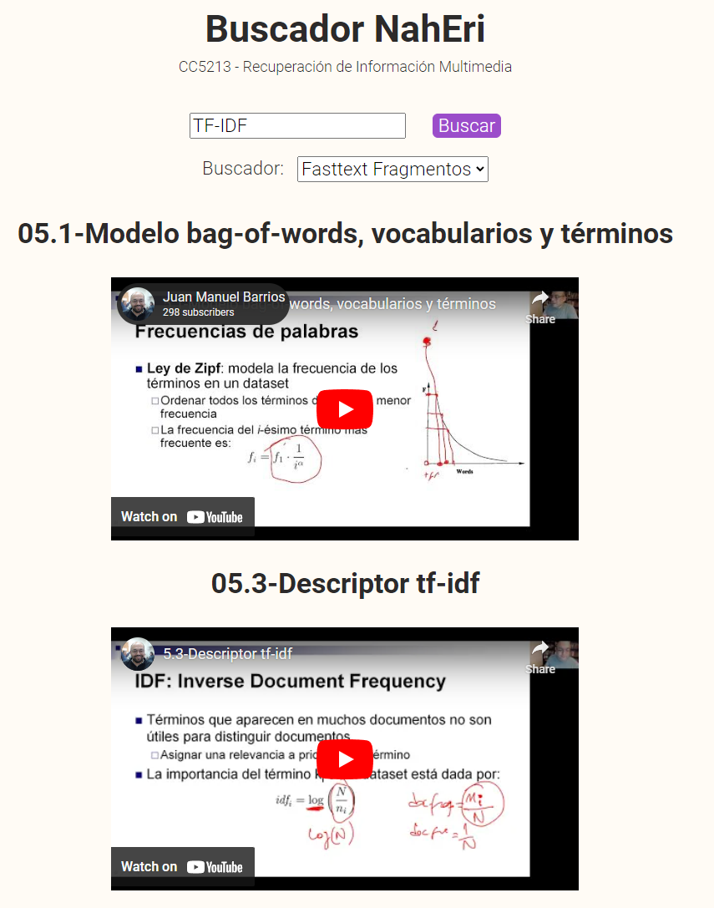

# CC5213-Proyecto-Final

Buscador de videos de catedra NahEri.

## Proyecto

Este software es una aplicación web que corre localmente. Su función es hacer busquedas en los 123 videos del curso `CC5213 - Recuperación de Información Multimedia``. Se implementaron, y compararon 10 técnicas de busqueda:

- TF-IDF (de SKLEARN), con solo títulos.
- TF-IDF + Stemming, con solo títulos.
- TF-IDF + Lemmatization, con solo títulos.
- TF-IDF, con textos completos.
- TF-IDF + Stemming, con textos completos.
- FastText, con solo títulos.
- FastText, con textos completos.
- FastText, por fragmentos de texto según transcripción.
- s-BERT, con textos completos. Modelo: `paraphrase-multilingual-mpnet-base-v2`
- s-BERT, con textos completos. Modelo: `all-distilroberta-v1`

## Estructura

```bash
📦CC5213-Proyecto-Final
 ┣ 📂models
 ┃ ┣ 📜busqueda_fasttext.py # Motor de busqueda con fasttext.
 ┃ ┣ 📜busqueda_sbert.py    # Motores de busqueda con s-BERT.
 ┃ ┣ 📜busqueda_tfidf.py    # Motor de busqueda con TF-IDF.
 ┃ ┣ 📜_.bin                # Archivos de modelos descargados localmente.
 ┃ ┗ 📜_.pkl                # Archivos de descirptores calculados offline
 ┣ 📂static                 # Javascript y CSS para el front-end
 ┣ 📂templates              # Templates HTML para el front-end
 ┣ 📂tests
 ┃ ┣ 📜gt_titulos.txt       # Ground truth para busqueda en títulos
 ┃ ┣ 📜gt_textos.txt        # Ground truth para busqueda en textos completos
 ┃ ┣ 📜gt_semantic.txt      # Ground truth para busquedas semanticas
 ┃ ┣ 📜mini_ground.csv      # G.t. para busq. por nombre de unidad en textos completos 
 ┃ ┣ 📜test_ground.py       # Test con varios ground truths de caso distintos
 ┃ ┗ 📜test_mini_ground.py  # Test visual con un mini-ground truth fijo
 ┣ 📂videos
 ┃ ┣ 📂transcripciones
 ┃ ┃ ┣ 📂transcripcion_completa
 ┃ ┃ ┗ 📂transcripcion_json
 ┃ ┣ 📜procesador_de_links.py   # Pre-procesador de metadatos de videos
 ┃ ┣ 📜titulos.py               # Agregador de titulos de videos
 ┃ ┣ 📜transcribir.py           # Descargador de transcripciones
 ┃ ┣ 📜unir_json.py             # Concatenador de transcripciones
 ┃ ┣ 📜_.txt                    # Listas de videos, URLs y otros meta-datos
 ┃ ┗ 📜_.csv                    # Idem
 ┣ 📜app.py                 # Aplicacion Flask
 ┣ 📜README.md               
 ┣ 📜requirements.txt       # Instalar antes de correr el proyecto
 ┗ 📜util.py                # Configuraciónes y funciones comunes a todos los archivos
```

## Uso

⚠ Warning: La primera vez que se corra el proyecto, el programa descarga los modelos de s-BERT y FastText. Esto puede tardar un poco.

⚠ Warning: La primera vez que se hace una busqueda con un modelo, se debe calcular los descriptores de los videos. Esto puede tardar un poco.

⚠ Warning: Si buscas con Fasttext, y despues con s-BERT o vice-versa, existe la posibilidad de que se le acabe la memoria a tu computador, dependiendo de cuanto tengas. Si te sucede esto, recomendamos que si quieres probar todos los modelos, reinicies la aplicaicón web luego de que cada uno se cargue.

### Instalación

Primero se deben instalar los requisitos. Recomendamos el uso de un ambiente virtual.

El proyecto requiere CUDA 11.7. Se puede instalar [aquí](https://developer.nvidia.com/cuda-11-7-0-download-archive)

Para los requisitos de python, se pueden correr los siguiente comandos en la terminal:

```bash
pip install -r requirements.txt
python -m spacy download es_core_news_sm
```

### Tests de Effectiveness

Para testear la efectividad, se puede ejecutar el archivo `test_ground.py` o `test_mini_ground.py`.
Idealmente se deben correr como modulos.

```bash
python -m tests.test_ground
```

```bash
python -m tests.test_mini_ground
```

### Aplicación Web

Para correr la aplicación web, se debe ejecutar el archivo `app.py`:

```bash
python app.py
```

Una vez lanzado, podrás elegir que buscador usar y hacer consultas.


